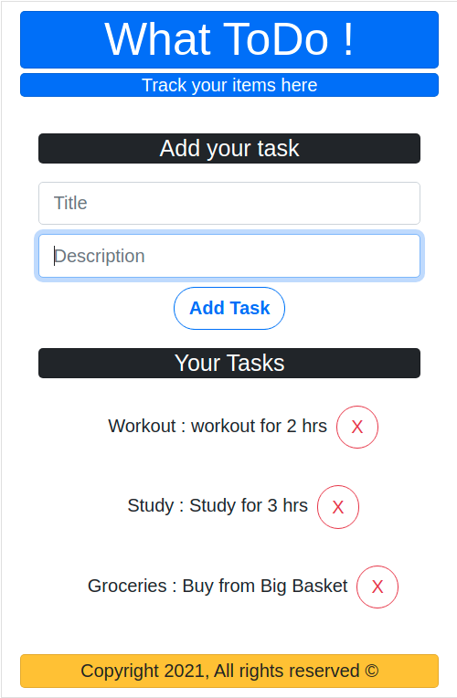
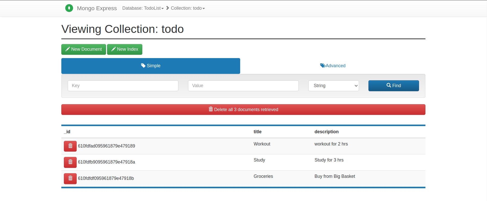

# What-ToDo
What-ToDo is a simple application to track the items to be completed. 
The application is built upon FARM stack (FastAPI - React - MongoDB). 
 - FastAPI - is the backend server. 
 - React - is the frondend client.
 - MongoDB - is used as the database for persistence of data.

## UI Screenshot

## DB Screenshot

